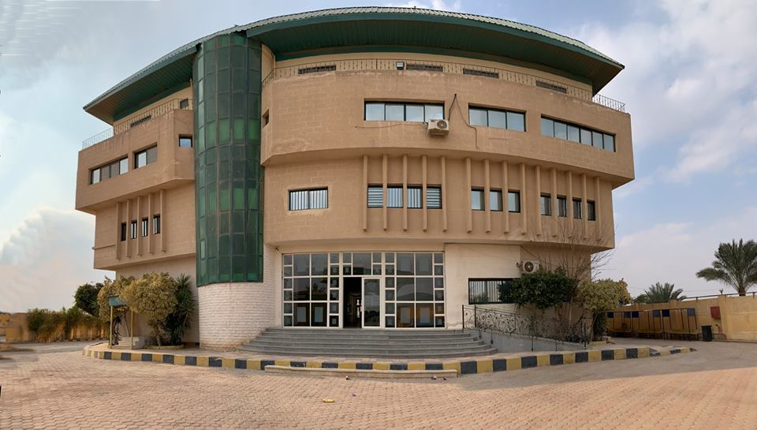

# Al-Safwa Website
**their some confige before upload the website **
- their is some `pdf file` not found (for the department )
- you can add some image and change it ( **slideshow** )
- if the website uploaded in apache server you can add some file to fast the speed loading of the page .

the last edit for the website can find in this link [al-safwa-test.firebaseapp.com](https://al-safwa-test.firebaseapp.com "al-safwa-test.firebaseapp.com")


[========]

## Slide show Section 
can add any number of  images  in slide show by add this simple code
``
inside the **div** that have class `slider-content` it will find it line 60 in index.html
and put the image in folder `img/sildeShow`
#### Example
```html
<div class="slider-content">
<!-- here you will be add the image link  -->
<!-- you can add any number of the image -->
    
    
    
    
</div>
```
#### waring don't forget to add the images into the  two file `index.html` and `/en/index.html`

------------


## the missing file (pdf file)
their some pdf file **missing** and you can it by add the pdf file in this folder `\file`
and link it in `department.html` 
#### Example
````html
 	<a href="files/3omara.pdf">المحتوي العلمي</a>
````
```html
	<a href="files/ ( the file name ).pdf">the file name in arabic or english</a>
```
#### waring don't forget to add the pdf file into the  two file `department.html` and `/en/department.html`

------------


# Issues
If you come across any issues please [report them here](https://github.com/meladsamuel/al-safwa/issues "report them here").
or 
contact us in **01120623331** ->(mahmoud amr) or **01275888348** ->(melad samuel)

# increse the speed of the websit
If you use server apache you can create the file `.htaccess`and put this code inside it 


```shell
# 1 Month for most static assets
<filesMatch ".(css|jpg|jpeg|png|gif|js|ico)$">
Header set Cache-Control "max-age=2592000, public"
</filesMatch>
```
